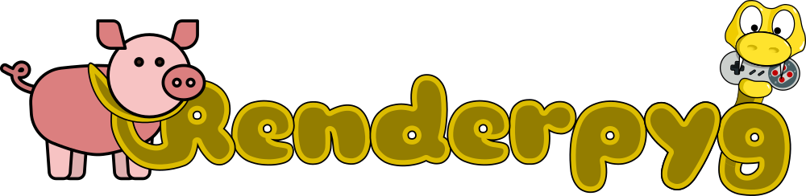
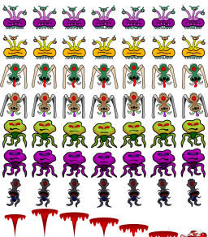
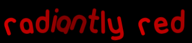
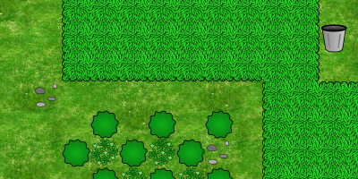
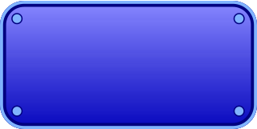

# renderpyg

## A pygame add-on for GPU texture rendering

Renderpyg is a python package that provides common game engine components for pygame. It utilize the experimental GPU accelerated texture renderer provided with pygame2 and will be updated to use the official sdl2.video API whenever it gets released. This version is written in pure python but later versions may be optimized in cython.

The design of renderpyg is meant to be accessible by beginners so they may focus on game logic instead of the mechanics of tilemaps, sprite animation, and text rendering. This manual should provide new pygame users a effective guide to producing a simple game from start to finish. 

## Features:
- Hardware GPU renderering for HD graphics on most current hardware, with Rasberry Pi and Android support coming
- Animated sprites with support keyframes, zooming, rotation, velocity, and more
- Text rendering that uses the GPU to draw and animate fonts
- Tilemaps with smooth scrolling, zooming, multiple layers, parallax backgrounds, and no practical size limits
- Supports loading Tiled tilemaps with optional pytmx module by bitcraft
- Nine-patch rendering for smoothly scaling windows, buttons, and other UI features
- Simple menuing system (soon)
- Screen transitions (soon)

## Installation Notes
pip install .  
python setup.py install --user  
python3 setup.py install --user  
pip install renderpyg  

## Sprites
The GPUAniSprite class is fully compatible with sprite groups and supports keyframe animation with transformations and cubic smoothing(soon). Basic usage is easy if you have a properly designed sprite sheet to use. Support for loading sprites created with sprite editing or texture packing software will be available in the future.

		anim = keyframes((1,2,3,4), 250, velocity=(15,0))
		sprite = GPUAniSprite((renderer, example_data+'aliens.png', 7, 8, by_count=True)
		sprite.set_animation(anim1, loop_type='back_forth', loop_count=-1)
		sprite.set_pos(100, 100)
		
		delta = 0
		for _ in range 1000:
			sprite.update(delta)
			sprite.draw()
			renderer.present()
			delta = clock.tick(60)
			renderer.clear()

## Textured Fonts
The TextureFont class supports True Type Fonts (.ttf) that can be loaded by the pygame.font module. It loads the font into texture memory for fast drawing, with optional scaling, color shifting, and animation. It does not support kerning at this time.

		tfont = TextureFont(renderer, example_data+'font.ttf', 64)
		for _ in range(1000):
			tfont.draw('Here is some static text', 10, 10)
			tfont.animate('Here is some animated text', 10, 100,
				scale=1.25, move=(5,10), rotate=30)
			renderer.present()
			clock.tick(60)
			renderer.clear

## Tilemaps
The Tilemap class can be used to draw tilemaps loaded from a Tiled tmx file or from a text string. Tilemaps support scrolling and zooming, and the camera can be used as a global transform that makes sure all of your other onscreen objects all draw in the right place.

		tilemap = load_tmx(renderer, path+'tilemap.tmx')
		background = load_texture(renderer, path+'background.png')
		scale = 1
		camera = pygame.Vector2()
		for _ in range(1000):
			tile_background(background, camera, parallax=False)
			render_tilemap(tilemap, camera, scale, clamp=True)
			renderer.present()
			clock.tick(60)
			renderer.clear()

## Nine-Patch
The NinePatch class can smoothly scale specialy designed images that are very useful for buttons and dialog boxes.

		texture = load_texture(renderer, example_data+'nine.png')
		nine = NinePatch(texture, (25,25,25,25))
		nine.draw((10,10,200,200)
		renderer.present()

### Advantages of the new pygame GPU texture rendering API
- Many times faster at rendering images
- Can support HD graphics
- Will run better on mobile and lower power devices
- Provides rotation and scaling without slowing down
- Rendering graphics with your GPU leaves your CPU free for logic and physics

### Disadvantages of the new pygame GPU texture rendering API
- Accessing the pixels in your graphics is very slow
- There are limited features for rendering primitives right now (circles, lines, etc)
- The texture rendering API is experimental and it might change.

### General Advice
- Accessing video memory is slow. Load all of your textures before you start your game loop
- For faster sprite batching, put as many images in as few textures as you can
- Avoid drawing images from different textures out of order
- In other words, draw all your sprites from one image file before going on to another
- Avoid using multiple copies of the same image in different textures
- All of your draw() calls are actually just batched until you call renderer.present()
- Render to an offscreen buffer if you plan to add screen transition effects later on
- Render to an offscreen buffer if you want to support fullscreen or different window sizes
- You can render into any texture that you create with the target=True flag
- When you load an image with transparency, the texture will be set for alpha blending
- If you create a texture yourself, you probably should set blendmode=1 for transparency

### Basic Usage Example

		import os, sys, random, math
		import pygame as pg
		from pygame._sdl2 import Window, Renderer, Texture, Image
		from renderpyg import Sprite, TextureFont

Set sdl2 for anisotropic filtering:
(0 for no filtering, 1 for bilinear filtering, 2 for anisotropic)  

		os.environ['SDL_RENDER_SCALE_QUALITY'] = '2'
		
		EXAMPLE_DATA = os.path.join(os.path.dirname(__file__), 'data','')
		RENDER_RESOLUTION = (1600, 900)
		WINDOW_RESOLUTION = (1600, 900)
		SMALL_RESOLUTION = (800, 450)
		FRAMES_PER_SECOND = 30
		FONT = EXAMPLE_DATA+'font.ttf' 
		FONT_SIZE = 72
		SPRITE_COUNT = 30
        FONT_PARAMS = dict(
            text='Dancing Font', x=10, y=10, color=(175,0,0), variance=30,
            circle=3, rotate=15, scale=.25, colors=(75,0,0))

		def main():
			FULLSCREEN = False
			pg.init()
			clock = pg.time.Clock()
			window = Window("Renderpyg Example", size=WINDOW_RESOLUTION)
			renderer = Renderer(window, vsync=True)

We will draw into a buffer texture to allow easy resolution changes
It will also make it easier to apply screen transitions and similar effects later

When using pygame._sdl2.video you do not call pygame.display.setmode()
Therefore calling surface.convert() or surface.convert_alpha() will throw an error
When you create a Texture that needs alpha blending you must set its blend mode
Alpha blening will be set automatically when loading from an image with transparency, such as PNG

Remember to use the buffer size instead of the window size when drawing onto the offscreen buffer
This will allow you to scale the screen to any window or fullscreen desktop size

			buffer = Texture(renderer, RENDER_RESOLUTION, target=True)
			buffer.blend_mode = 1 
			screensize = buffer.get_rect()

You can set fullscreen when creating the window by using Window(title, size, desktop_fullscreen=True)
I prefer creating a window before going to fullscreen to avoid strange window placement that occurs
if you exit fullscreen later on.

			if FULLSCREEN:
				window.set_fullscreen(True)

Font features in pygame are design for blitting to a surface, not for GPU rendering
It is possible to create a streaming texture and then using texture.update() to update the texture
from a pygame surface, but accessing GPU memory is slow and this should be done sparingly.

Therefore I created a simple TextureFont class. We will use the animation feature of this class
for a little extra fun. We will also create some sprites and let them animate too.

Also, for this example we use a Character class to move and rotate individual characters across
the screen. This is very similar to how you will handle sprites later.

			tfont = TextureFont(renderer, pg.font.Font(FONT, FONT_SIZE))
			sprite = Sprite(
				(renderer, EXAMPLE_DATA+'aliens.png'), 10, 14, by_count=True)
			group = pg.sprite.Group()
			animations = [
				keyrange(0, 7, 200),
				keyrange(7, 14, 200),
				keyrange(14, 21, 200),
				keyrange(21, 28, 200)]

			for _ in range(SPRITE_COUNT):
				spr = Sprite(sprite.images)		
				spr.set_pos(
					rand.randrange(0, RENDER_RESOLUTION[0]),
					rand.randrange(0, RENDER_RESOLUTION[1]) )
				spr.set_animation(random.choice(animations, -1)
				spr.velocity = pg.Vector2(
					rand.randrange(-10, 10)
					rand.randrange(-10, 10))
				if rand.randint(10) < 2:
						spr.rotation = rand.randint(-10, 10)
	        	group.add(spr)

Here starts a simple game loop
Press SPACE to toggle between a large window, a small window, and fullscreen
Press ENTER to add more characters to the screen

At the beginning of each frame we must set the renderer target to our buffer Texture
All the following draw calls will be drawn to the buffer instead of the screen
After all of our drawing, we reset the target and draw the buffer onto the screen

			timer = pg.time.get_ticks()
			delta = 0
			running = True
			while running:
				renderer.target = buffer 
				for event in pg.event.get():
					if event.type == pg.QUIT:
						running = False
					elif event.type == pg.KEYDOWN:
						if event.key == pg.K_ESCAPE:
							running = False
						elif event.key == pg.K_SPACE:
                            if FULLSCREEN:
                                FULLSCREEN = False
                                window.size = WINDOW_RESOLUTION
                                window.set_windowed()
                            elif window.size == WINDOW_RESOLUTION:
                                window.size = SMALL_RESOLUTION
                            else:
                                FULLSCREEN = True
                                window.size = WINDOW_RESOLUTION
                                window.set_fullscreen(True)

Must set the draw color before clearing the scren or drawing lines and rects

				renderer.draw_color = (0,0,0,255) 
				renderer.clear()

Draw the background image if available. 
By default Texture.draw() will fill the renderer unless you supply a destination Rect
texture.draw( dstrect=Rect(x, y, width, height) )

				group.update(delta)
				group.draw()
				tfont.Animate(**FONT_PARAMS)

Setting renderer.target = None will make following draw calls render to the underlying window
Since we don't provide a dstrect it will fill the renderer

				renderer.target = None
				buffer.draw()
				renderer.present() # all draw calls occur and the screen is updated here
				delta = clock.tick(FRAMES_PER_SECOND)

### Base Functions

**fetch_images**(texture, width, height, spacing=0, margin=0, by_count=False)  
Returns an image list generated from a given texture and either the
image size or the number of images in a sprite sheet.
     
    :param textue: texture to fetch images from
    :param width: width of images, or number of columns if by_count=True
    :param height: height of images, or number of rows if by_count=True
    :param spacing: space between each image in the texture
    :param margin: margin of empty space around the edge of texture
    :param by_count: set True to use width and height value to
            calculate frame size from width and height of spritesheet
    :rvalue: list of pygame._sdl2.video.Image objects

**load_images**(renderer, filename, width, height, spacing=0, margin=0, by_count=False)  
Load a texture from given image file and generate a series of
images from it with the given width and height.
     
    :param renderer: renderer object for loading texture into
    :param filename: name of image file to load
    :param width: width of each image, or column count if by_count=True
    :param height: height of each cell, or row count if by_count=True
    :param spacing: space between each tile of the image
    :param margin: margin of empty space around edge of the image
    :param by_count: set True to use width and height value to
            calculate frame size from width and height of spritesheet
    :rvalue: list of pygame._sdl2.video.Image objects

**load_texture**(renderer, filename)  
Returns an texture loaded from given image file and attached to
given renderer.
     
    :param renderer: active pygame._sdl2.video.Renderer object
    :param filename: path to image file
    :rvalue: texture object
     
**scale_rect**(rect, amount)  
Return new Rect scaled by given multiplier where 1.0 is 100%

    :param rect: the rect you want to scale
    :param amount: < 1.0 will shrink the rect, above 1.0 will enlarge it
    :rvalue Rect: new scaled Rect

**scale_rect_ip**(rect, amount)  
Scale given rect by given multiplier where 1.0 is 100%

	:param rect: the rect you want to scale
	:param amount: < 1.0 will shrink the rect, above 1.0 will enlarge it
	:rvalue Rect:

### TextureFont Class

**init**(self, renderer, filename, size)  
Initialize TextureFont for use with pygame._sdl2 GPU renderer
     
    :param renderer: pygame._sdl2.video.Renderer to draw on
    :param filename: path to a pygame.font.Font compatible file (ttf)
    :param size: point size for font

**animate**(self, text, x, y, color=(255, 255, 255), center=False, duration=3000, **kwargs)  
Draw animated text onto pygame._sdl2 GPU renderer
     
    :param text: text to draw
    :param x: x coordinate to draw at
    :param y: y coordinate to draw at
    :param color: base (r,g,b) color tuple to draw text
    :param fade: amount to fade during duration
    :param duration: time in ms for complete animation cycle
    :param variance: percent to vary animation cycle between each character
    :param timer: optional start time from pygame.time.get_ticks()
            useful to differentiate multiple animations
    :param scale: percent of size to scale during animation cycle
    :param rotate: degrees to rotate during animation cycle
    :param colors: optional (r,g,b) amount to cycle color 
    :param move: optional x, y variance to move characters
    :param circle: optional radius to move characters (overrides move)
    :rvalue Rect: area where the text was drawn

**draw**(self, text, x, y, color=None, alpha=None, center=False)  
Draw text string onto pygame._sdl2 GPU renderer
     
    :param text: string to draw
    :param x: x coordinate to draw at
    :param y: y coordinate to draw at
    :param color: (r,g,b) color tuple
    :param alpha: alpha transparency value
    :param center: treat x,y coordinate as center position
    :rvalue Rect: area were the text was drawn

**width**(self, text)  
Calculate width of given text not including motion or scaling effects
     
    :param text: text string to calculate width of
    :rvalue: width of string in pixels

### GPUAniSprite Class
from renderpyg.sprite import Sprite

**init**(self, source, width, height, **kwargs)

Create animated sprite object
     
    :param source: texture, image, or (renderer, filename) pair to
            load image from
    :param width: width of each animation frames
    :param height: height of each animation frame
    :param spacing: space between each animation frame
    :param margin: border between image edges and animation frames
    :param by_count: set True to use width and height value to
            calculate frame size from width and height of spritesheet

**draw**(self)  
Render the sprite at its current position
Use set_pos() and set_frame() modify where and how to draw it

**draw_debug**(self, color=(255, 255, 255, 255))  
Render the sprite at its current position, showing collision
hit box and anchor point for debugging.
     
    :param color: color and alpha value for outline, default white

**interrupt**(self, animation, loop_type='forward')  
Interrupt current animation and play given one once before resuming
previous animation.
     
    :param animation: list of animation keyframes
    :param loop_type: playback mode from available loop types:
                    'forward', 'back_forth', 'reverse'
    :rtype None:

**queue_animation**(self, animation, loop_count=0, loop_type='forward')  
Queue animation to play following the current animation.

This method will let the current animation's loop count finish
or play after current cycle when a continous loop is playing.
Multiple animations     may be queued and will play in First In 
First Out order.

    :param animation: list of animatin keyframes
    :param loop_count: number of times to loop animation,
            or -1 for continuous
    :param loop_type: playback mode from available loop types:
                    'forward', 'back_forth', 'reverse'
    :rvalue None:

**queue_event**(self, func, *args, **kwargs)  
Queue events to be executed after current animation finishes.

This method will let the current animation's loop count finish
or play after current cycle when a continous loop is playing.
All queue events will execute when the first animation finishes.

    :param func: function to all
    :param args: arguments to pass into function
    :param kwargs: keyword arguments to pass into function
    :rvalue None:

**set_anchor**(self, anchor)  
Set anchor point to draw image around. Default (0,0) at 
top-left corner
     
    :param anchor: (x,y) pair or Vector2

**set_animation**(self, animation, loop_count=0, loop_type='forward')  
Start animation based on keyframe list and loop count
     
    :param animation: list of keyframes as generated by keyfr()
    :param loop_count: number of times to loop animation,
            or -1 for continous
    :param loop_type: playback mode from available loop types:
                    'forward', 'back_forth', 'reverse'
    :rvalue None:

**set_frame**(self, frame=0, duration=0, **kwargs)  
Set frame number and other parameters as generated by keyfr()
     
    :param frame: frame number or name string
    :param duration: length for current frame transitions, used
            mostly with set_animation()

**set_hitbox**(self, box)  
Set collision area of the sprite
     
    :param box: rect area for hit box based on top-left corner of image
    :rvalue None:

**set_pos**(self, x, y=None)  
Set new sprite location and update rects for drawing and collision

    :param x: x coordinate, (x,y) pair, or Vector2
    :param y: y cordinate if (x,y) pair and Vector2 not used
    :rvalue None:

**set_transform**(self, transform)  
Set camera and zoom transform to support a scrolling tilemap or background
     
    :transform: (x,y,zoom) triplet or Vector3
    :rvalue None:

**stop**(self)  
Stop current animation and transformation. The image will stay where it is.

**update**(self, delta)  
Update the sprite's animation based on time delta in milliseconds
     
    :param delta: time in milliseconds that passed since the last update()
    :rvalue None:

### Keyframe Helper Functions

**keyfr**(frame=0, duration=1000, **kwargs)  
Returns a single keyframe with given parameters
     
    :param frame: name or number of image for this keyframe
    :param duration: time in milliseconds for this keyframe
    :param angle: degrees of clockwise rotation around a center origin
    :param flipx: set True to flip image horizontally
    :param flipy: set True flip image vertically
    :param color: (r,g,b) triplet to shift color values
    :param alpha: alpha transparency value
    :param scale: scaling multiplier where 1.0 is unchanged
    :param pos: optional (x,y) pair or Vector2 to set sprite position
    :param velocity: optional (x,y) or Vector2 for sprite to move
     	measured in pixels per second
    :param rotation: optional degrees of clockwise rotation per second
    :param scaling: optional amount to scale per second where 0 = None
    :param fading: optional int to subract from alpha value per second
    :param coloring: (r,g,b) triplet to shift each color value per second

**keyframes**(frames=[], duration=1000, **kwargs)  
Returns a list of frames sharing the same parameters
   
Any additional parameters availble for keyfr() are allowed and will
be set for each keyframe in the list.

    :param frames: list of image names or numbers to build keyframes
            that share the given parameters.
    :param duration: time in milliseconds for every keyframe

**keyrange**(start, end, duration=1000, **kwargs)  
Returns a list of frames sharing the same parameters
     
Any additional parameters availble for keyfr() are allowed and will
be set for each keyframe in the list.

    :param start: the first frame number for a range of frames used to
            build a list of keyframes that share the given parameters
    :param end: the last frame number for a range of frames used to
            build a list of keyframes that share the given parameter
    :param duration: time in milliseconds for every keyframe

### Tilemap Class
Simple tilemap class available as replacement for the recommended
pytmx module
 
**init**(self, _map, cells)  
Initialize inbuilt Tilemap object for drawing with pygame GPU renderer.
     
    :param tuple _map: tilemap returned from load_tilemap_string()
    :param list cells: tileset loaded with the load_tileset()

**add_layer**(self, _map)  
Add a layer to the Tilemap
     
    :param tuple _map: tilemap returned by the load_tilemap_string()
    :rvalue: None

**update_tilemap**(self, _map, layer=0)  
Replace given layer with new tilemap data
     
    :param _map: tilemap loaded by load_tilemap_string() function
    :param layer: index of layer in self.layers to replace, def = 0
    :rvalue: None

**update_tileset**(self, replacement)  
Replace the images in the Tilemap or the texture they reference
     
    :param replacement: texture or list of image
    :rvalue: None

**verify_tilemap**(self, _map)  
Verify tilemap layer validity
     
    :param _map: tilemap returned by load_tilemap_string() function
    :rvalue: True if tilemap is valid

###Tilemap Helper Functions

**load_tilemap_string**(data, delimit=',', line_break='\n', default=0, fill=True)  
Load data from a string into a tilemap. A tilemap is a python list
of arrays with unsigned int values. Tilemap data can be accessed as
tilemap[y_cell][x_cell] where x_cell < width, y_cell < height, and
the highest value is returned as highest_value.
     
    :param data: a single python string of int values for each cell in map
    :param delimit: delimiter separating int values, def = ','
    :param line_break: delimiter separaing each row, def = '\n'
    :param default: value to replace invalid or missing cell values
    :param fill: fill short rows with default if true(def),
                    else trim lines to shortest
    :rvalue: tilemap, (width, height, highest_value)

**load_tileset**(renderer, filename, width, height, spacing=0, margin=0, texture=None, by_count=False)  
Load a tileset from given filename using tiles with given width and
height.The tileset can be attached to a Tilemap object and then
rendered with the render_tilemap() function.

    :param renderer: renderer to attach texture to
    :param filename: image file to load images from
    :param width: width of images, or number of columns if by_count=True
    :param height: height of images, or number of rows if by_count=True
    :param spacing: space between each image in the texture
    :param margin: margin of empty space around the edge of texture
    :param by_count: set True to use width and height value to
            calculate frame size from width and height of spritesheet
    :param texture: fetch images from this texture instead of filename
    :rvalue: list of pygame._sdl2.video.Image objects

**load_tmx**(renderer, filename, *args, **kwargs)  
This function simplifies loading tilemaps from tiled tmx files
It uses a partial function to provide a renderer reference to pytmx
     
    :param renderer: active video.Renderer
    :param filename: path to Tiled tmx tilemap file
    :rvalue pytmx.TiledMap

**render_tilemap**(tilemap, camera=(0, 0), scale=1, **kwargs)  
Draw pytmx or inbuilt tilemap onto pygame GPU renderer

    :param tilemap: pytmx or internal tilemap class
    :param camera: pg.Vector2 for top left camera location
    :param scale: float scale value defaults to 1.0
    :param center: pg.Vector2 to set center camera location
                    True to adjust camera for center
                    Overides camera
    :param srcrect: area to render in world coordinates overides scale
                    Ignores height to maintain aspect ratio
    :param dstrect: screen area to render into
                    defaults to entire renderer area
    :param smooth: for smoother scaling transition but less accurate
    :param clamp: True to adjust camera to fit world coordinates
    :rvalue (camx, camy, scale): for adjusting other images

##Disclaimer
Copyright (C) 2020, Michael C Palmer <michaelcpalmer1980@gmail.com>

This file is part of renderpyg

renderpyg is a python package providing higher level features for
pygame. It uses the pygame._sdl2.video API to provide hardware GPU
texture rendering.

renderpyg is free software: you can redistribute it and/or modify
it under the terms of the GNU Lesser General Public License as
published by the Free Software Foundation, either version 3 of the
License, or (at your option) any later version.
pytmx is distributed in the hope that it will be useful,
but WITHOUT ANY WARRANTY; without even the implied warranty of
MERCHANTABILITY or FITNESS FOR A PARTICULAR PURPOSE.

See the GNU Lesser General Public License for more details.
You should have received a copy of the GNU Lesser General Public
License along with renderpyg.

If not, see <http://www.gnu.org/licenses/>.
