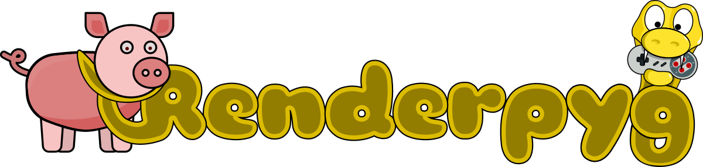

# renderpyg


## A pygame add-on for GPU texture rendering

Renderpyg is a python package that provides common game engine components for pygame. It utilize the experimental GPU accelerated texture renderer provided with pygame2 and will be updated to use the official sdl2.video API whenever it gets released. This version is written in pure python but later versions may be optimized in cython.

The design of renderpyg is meant to be accessible by beginners so they may focus on game logic instead of the mechanics of tilemaps, sprite animation, and text rendering. This manual should provide new pygame users a effective guide to producing a simple game from start to finish. 

## Contents
- Features
- Installation Notes
- Sprites
- Textured Fonts
- Tilemaps
- Nine Patches
- GPU Advantages and Disadvantages
- General Advice
- Basic Usage Example
- API Reference
    * Base Functions
    * GPUAniSprite
    * NinePatch
    * TextureFont
    * Tilemap

## Features:
- Hardware GPU renderering for HD graphics on most current hardware, with Rasberry Pi and Android support coming
- Animated sprites with support keyframes, zooming, rotation, velocity, and more
- Text rendering that uses the GPU to draw and animate fonts
- Tilemaps with smooth scrolling, zooming, multiple layers, parallax backgrounds, and no practical size limits
- Supports loading Tiled tilemaps with optional pytmx module by bitcraft
- Load images from a TextureAtlas XML created with TexturePacker
- Nine-patch rendering for smoothly scaling windows, buttons, and other UI features
- Simple menuing system (soon)
- Screen transitions (soon)

## Installation Notes
Renderpyg requires python 3.5, pygame 2.0.0, and SDL 2.0 or later versions. It is designed for GPU rendering, so
your operating system and hardware must support OpenGL, DirectX, or Vulkan acceleration with SDL2.

You can try one of the following methods to install renderpyg from the directory you extracted it to.

```
pip install .  
python setup.py install --user  
python3 setup.py install --user  
pip install renderpyg (installing from server available soon)
```

Once installed, you can try one of the included examples as follows.

```
python -m renderpyg.examples - list all examples
python -m renderpyg.examples sprites - run the sprites example
```

## Sprites
The GPUAniSprite class is fully compatible with sprite groups and supports keyframe animation with transformations and cubic smoothing(soon). Basic usage is easy if you have a properly designed sprite sheet to use.

You may load images from an XML file created with TexturePacker. You must save it into XML format, uncheck
*Allow Rotation*, uncheck *Allow Trim*, and check *Fixed Size* in the options when you save your XML file. You may then load it with the renderpyg.load_xml_images() function.


```py
anim = keyframes((1,2,3,4), 250, velocity=(15,0))
sprite = GPUAniSprite((renderer, example_data+'aliens.png', 7, 8, by_count=True)
sprite.set_animation(anim1, loop_type='back_forth', loop_count=-1)
sprite.set_pos(100, 100)

delta = 0
for _ in range 1000:
    sprite.update(delta)
    sprite.draw()
    renderer.present()
    delta = clock.tick(60)
    renderer.clear()
```

## Textured Fonts
The TextureFont class supports True Type Fonts (.ttf) that can be loaded by the pygame.font module. It loads the font into texture memory for fast drawing, with optional scaling, color shifting, and animation. It does not support kerning at this time.

For best performance you should use as few textures as possible. Use TextureFont.multi_font() to load multiple fonts into the same texture.


```py
tfont = TextureFont(renderer, example_data+'font.ttf', 64)
for _ in range(1000):
    tfont.draw('Here is some static text', 10, 10)
    tfont.animate('Here is some animated text', 10, 100,
        scale=1.25, move=(5,10), rotate=30)
    renderer.present()
    clock.tick(60)
    renderer.clear
```

## Tilemaps
The Tilemap class can be used to draw tilemaps loaded from a Tiled tmx file or from a text string. Tilemaps support scrolling and zooming, and the camera can be used as a global transform that makes sure all of your other onscreen objects all draw in the right place.


```py
tilemap = load_tmx(renderer, path+'tilemap.tmx')
background = load_texture(renderer, path+'background.png')
scale = 1
camera = pygame.Vector2()
for _ in range(1000):
    tile_background(background, camera, parallax=False)
    render_tilemap(tilemap, camera, scale, clamp=True)
    renderer.present()
    clock.tick(60)
    renderer.clear()
```

## Nine Patches
The NinePatch class can smoothly scale specialy designed images that are very useful for buttons and dialog boxes.


```py
texture = load_texture(renderer, example_data+'nine.png')
nine = NinePatch(texture, (25,25,25,25))
nine.draw((10,10,200,200)
renderer.present()
```

### Advantages of the new pygame GPU texture rendering API
- Many times faster at rendering images
- Can support HD graphics
- Will run better on mobile and lower power devices
- Provides rotation and scaling without slowing down
- Rendering graphics with your GPU leaves your CPU free for logic and physics

### Disadvantages of the new pygame GPU texture rendering API
- Accessing the pixels in your graphics is very slow
- There are limited features for rendering primitives right now (circles, lines, etc)
- The texture rendering API is experimental and it might change.

### General Advice
- Accessing video memory is slow. Load all of your textures before you start your game loop
- For faster sprite batching, put as many images in as few textures as you can
- Avoid drawing images from different textures out of order
- In other words, draw all your sprites from one image file before going on to another
- Avoid using multiple copies of the same image in different textures
- All of your draw() calls are actually just batched until you call renderer.present()
- Render to an offscreen buffer if you plan to add screen transition effects later on
- Render to an offscreen buffer if you want to support fullscreen or different window sizes
- You can render into any texture that you create with the target=True flag
- When you load an image with transparency, the texture will be set for alpha blending
- If you create a texture yourself, you probably should set blendmode=1 for transparency

### Basic Usage Example

```py
import os, sys, random, math
import pygame as pg
from pygame._sdl2 import Window, Renderer, Texture, Image
from renderpyg import Sprite, TextureFont
```

Set sdl2 for anisotropic filtering:
(0 for no filtering, 1 for bilinear filtering, 2 for anisotropic)  

```py
os.environ['SDL_RENDER_SCALE_QUALITY'] = '2'

EXAMPLE_DATA = os.path.join(os.path.dirname(__file__), 'data','')
RENDER_RESOLUTION = (1600, 900)
WINDOW_RESOLUTION = (1600, 900)
SMALL_RESOLUTION = (800, 450)
FRAMES_PER_SECOND = 30
FONT = EXAMPLE_DATA+'font.ttf' 
FONT_SIZE = 72
SPRITE_COUNT = 30
FONT_PARAMS = dict(
    text='Dancing Font', x=10, y=10, color=(175,0,0), variance=30,
    circle=3, rotate=15, scale=.25, colors=(75,0,0))

def main():
    FULLSCREEN = False
    pg.init()
    clock = pg.time.Clock()
    window = Window("Renderpyg Example", size=WINDOW_RESOLUTION)
    renderer = Renderer(window, vsync=True)
```

We will draw into a buffer texture to allow easy resolution changes. It will also make it easier to apply screen transitions and similar effects later.

When using pygame._sdl2.video you do not call pygame.display.setmode(). Therefore calling surface.convert() or surface.convert_alpha() will throw an error.
When you create a Texture that needs alpha blending you must set its blend mode.
Alpha blending will be set automatically when loading from an image with transparency, such as PNG

Remember to use the buffer size instead of the window size when drawing onto the offscreen buffer.
This will allow you to scale the screen to any window or fullscreen desktop size,

```py
    buffer = Texture(renderer, RENDER_RESOLUTION, target=True)
    buffer.blend_mode = 1 
    screensize = buffer.get_rect()
```

You can set fullscreen when creating the window by using Window(title, size, desktop_fullscreen=True)
I prefer creating a window before going to fullscreen to avoid strange window placement that occurs
if you exit fullscreen later on.

```py
    if FULLSCREEN:
        window.set_fullscreen(True)
```

Font features in pygame are design for blitting to a surface, not for GPU rendering.
It is possible to create a streaming texture and then use texture.update() to update the texture
from a pygame surface, but accessing GPU memory is slow and this should be done sparingly.

Therefore I created a simple TextureFont class. We will use the animation feature of this class
for a little extra fun. We will also create some sprites and animate them too.

```py
    tfont = TextureFont(renderer, pg.font.Font(FONT, FONT_SIZE))
    sprite = Sprite(
        (renderer, EXAMPLE_DATA+'aliens.png'), 10, 14, by_count=True)
    group = pg.sprite.Group()
    animations = [
        keyrange(0, 7, 200),
        keyrange(7, 14, 200),
        keyrange(14, 21, 200),
        keyrange(21, 28, 200)]

    for _ in range(SPRITE_COUNT):
        spr = Sprite(sprite.images)		
        spr.set_pos(
            rand.randrange(0, RENDER_RESOLUTION[0]),
            rand.randrange(0, RENDER_RESOLUTION[1]) )
        spr.set_animation(random.choice(animations, -1)
        spr.velocity = pg.Vector2(
            rand.randrange(-10, 10)
            rand.randrange(-10, 10))
        if rand.randint(10) < 2:
                spr.rotation = rand.randint(-10, 10)
        group.add(spr)
```

Here we start a simple game loop. Press SPACE to toggle between a large window, a small window, and fullscreen.

At the beginning of each frame we must set the renderer target to our buffer texture. All the following draw calls will be
drawn to the buffer instead of the screen. After all of our drawing, we reset the target and draw the buffer onto the screen

```py
    timer = pg.time.get_ticks()
    delta = 0
    running = True
    while running:
        renderer.target = buffer 
        for event in pg.event.get():
            if event.type == pg.QUIT:
                running = False
            elif event.type == pg.KEYDOWN:
                if event.key == pg.K_ESCAPE:
                    running = False
                elif event.key == pg.K_SPACE:
                    if FULLSCREEN:
                        FULLSCREEN = False
                        window.size = WINDOW_RESOLUTION
                        window.set_windowed()
                    elif window.size == WINDOW_RESOLUTION:
                        window.size = SMALL_RESOLUTION
                    else:
                        FULLSCREEN = True
                        window.size = WINDOW_RESOLUTION
                        window.set_fullscreen(True)
```

We should set the draw color before clearing the screen or drawing lines and rects.

```py
        renderer.draw_color = (0,0,0,255) 
        renderer.clear()
```

Now we update and draw the sprites. The delta variable is used to maintain the correct animation speed by
tracking the time since the last call to clock.tick().

```py
        group.update(delta)
        group.draw()
        tfont.Animate(**FONT_PARAMS)
```

Setting renderer.target = None will make following draw calls render to the underlying window.
Since we don't provide a dstrect it will fill the renderer, thereby scaling to any screen size. You
may wish to take extra consideration to aspect ratio in your own games.

```py
        renderer.target = None
        buffer.draw()
        renderer.present() # all draw calls occur and the screen is updated here
        delta = clock.tick(FRAMES_PER_SECOND)
```

### Base Functions

**fetch_images**(texture, width, height, spacing=0, margin=0, by_count=False)  
Returns an image list generated from a given texture and either the
image size or the number of images in a sprite sheet.
     
- *texture*:  texture to fetch images from
- *width*:  width of images, or number of columns if by_count=True
- *height*:  height of images, or number of rows if by_count=True
- *spacing*:  space between each image in the texture
- *margin*:  margin of empty space around the edge of texture
- *by_count*:  set True to use width and height value to
            calculate frame size from width and height of spritesheet
- *rvalue*:  list of pygame._sdl2.video.Image objects

**load_images**(renderer, filename, width, height, spacing=0, margin=0, by_count=False)  
Load a texture from given image file and generate a series of
images from it with the given width and height.
    
- *renderer*:  renderer object for loading texture into
- *filename*:  name of image file to load
- *width*:  width of each image, or column count if by_count=True
- *height*:  height of each cell, or row count if by_count=True
- *spacing*:  space between each tile of the image
- *margin*:  margin of empty space around edge of the image
- *by_count*:  set True to use width and height value to
            calculate frame size from width and height of spritesheet
- *rvalue*:  list of pygame._sdl2.video.Image objects

**load_texture**(renderer, filename)  
Returns an texture loaded from given image file and attached to
given renderer.
     
- *renderer*:  active pygame._sdl2.video.Renderer object
- *filename*:  path to image file
- *rvalue*:  texture object

**load_xml_images**(renderer, filename, _filter=[], by_name=False)  
Load images from a TextureAtlas XML file. Images may be filtered
and are return in a list, or optionally, a dict images indexed by
the name found in the xml file.

- *renderer*:  renderer to attach texture to
- *filename*:  path to a valid TextureAtlas XML file
- *fiter*:  list of file names or numbers to include in the list
- *by_name*:  set true to return a dict with image names
- *rvalue*:  list of images as ordered in filename by default
		optionally returns dict with image names instead

**scale_rect**(rect, amount)  
Return new Rect scaled by given multiplier where 1.0 is 100%

- *rect*:  the rect you want to scale
- *amount*:  < 1.0 will shrink the rect, above 1.0 will enlarge it
- *rvalue*:  Rect new scaled Rect

**scale_rect_ip**(rect, amount)  
Scale given rect by given multiplier where 1.0 is 100%

- *rect*: the rect you want to scale
- *amount*: < 1.0 will shrink the rect, above 1.0 will enlarge it
- *rvalue*:  Rect


### GPUAniSprite Class  
Class for rendering and animating game objects using the
pygame._sdl2 GPU renderer. Retains compatability with the sprite
groups provided pygame. May access through renderpy.Sprite()

**init**(self, source, width, height, **kwargs)

Create animated sprite object
     
- *source*:  texture, image, or (renderer, filename) pair to
            load image from
- *width*:  width of each animation frames
- *height*:  height of each animation frame
- *spacing*:  space between each animation frame
- *margin*:  border between image edges and animation frames
- *by_count*:  set True to use width and height value to
            calculate frame size from width and height of spritesheet

**draw**(self)  
Render the sprite at its current position
Use set_pos() and set_frame() modify where and how to draw it

**draw_debug**(self, color=(255, 255, 255, 255))  
Render the sprite at its current position, showing collision
hit box and anchor point for debugging.
     
- *color*:  color and alpha value for outline, default white

**interrupt**(self, animation, loop_type='forward')  
Interrupt current animation and play given one once before resuming
previous animation.
     
- *animation*:  list of animation keyframes
- *loop_type*:  playback mode from available loop types:
                    'forward', 'back_forth', 'reverse'
    :rtype None:

**queue_animation**(self, animation, loop_count=0, loop_type='forward')  
Queue animation to play following the current animation.

This method will let the current animation's loop count finish
or play after current cycle when a continous loop is playing.
Multiple animations     may be queued and will play in First In 
First Out order.

- *animation*:  list of animatin keyframes
- *loop_count*:  number of times to loop animation,
            or -1 for continuous
- *loop_type*:  playback mode from available loop types:
                    'forward', 'back_forth', 'reverse'
- *rvalue None*: 

**queue_event**(self, func, *args, **kwargs)  
Queue events to be executed after current animation finishes.

This method will let the current animation's loop count finish
or play after current cycle when a continous loop is playing.
All queue events will execute when the first animation finishes.

- *func*:  function to all
- *args*:  arguments to pass into function
- *kwargs*:  keyword arguments to pass into function
- *rvalue*:  None

**set_anchor**(self, anchor)  
Set anchor point to draw image around. Default (0,0) at 
top-left corner
     
- *anchor*:  (x,y) pair or Vector2

**set_animation**(self, animation, loop_count=0, loop_type='forward')  
Start animation based on keyframe list and loop count
     
- *animation*:  list of keyframes as generated by keyfr()
- *loop_count*:  number of times to loop animation,
            or -1 for continous
- *loop_type*:  playback mode from available loop types:
                    'forward', 'back_forth', 'reverse'
- *rvalue None*: 

**set_frame**(self, frame=0, duration=0, **kwargs)  
Set frame number and other parameters as generated by keyfr()
     
- *frame*:  frame number or name string
- *duration*:  length for current frame transitions, used
            mostly with set_animation()

**set_hitbox**(self, box)  
Set collision area of the sprite
     
- *box*:  rect area for hit box based on top-left corner of image
- *rvalue None*: 

**set_pos**(self, x, y=None)  
Set new sprite location and update rects for drawing and collision

- *x*:  x coordinate, (x,y) pair, or Vector2
- *y*:  y cordinate if (x,y) pair and Vector2 not used
- *rvalue None*: 

**set_transform**(self, transform)  
Set camera and zoom transform to support a scrolling tilemap or background
     
    :transform: (x,y,zoom) triplet or Vector3
- *rvalue None*: 

**stop**(self)  
Stop current animation and transformation. The image will stay where it is.

**update**(self, delta)  
Update the sprite's animation based on time delta in milliseconds
     
- *delta*:  time in milliseconds that passed since the last update()
- *rvalue None*: 

#### Keyframe Helper Functions

**keyfr**(frame=0, duration=1000, **kwargs)  
Returns a single keyframe with given parameters
     
- *frame*:  name or number of image for this keyframe
- *duration*:  time in milliseconds for this keyframe
- *angle*:  degrees of clockwise rotation around a center origin
- *flipx*:  set True to flip image horizontally
- *flipy*:  set True flip image vertically
- *color*:  (r,g,b) triplet to shift color values
- *alpha*:  alpha transparency value
- *scale*:  scaling multiplier where 1.0 is unchanged
- *pos*:  optional (x,y) pair or Vector2 to set sprite position
- *velocity*:  optional (x,y) or Vector2 for sprite to move
     	measured in pixels per second
- *rotation*:  optional degrees of clockwise rotation per second
- *scaling*:  optional amount to scale per second where 0 = None
- *fading*:  optional int to subract from alpha value per second
- *coloring*:  (r,g,b) triplet to shift each color value per second

**keyframes**(frames=[], duration=1000, **kwargs)  
Returns a list of frames sharing the same parameters
   
Any additional parameters availble for keyfr() are allowed and will
be set for each keyframe in the list.

- *frames*:  list of image names or numbers to build keyframes
            that share the given parameters.
- *duration*:  time in milliseconds for every keyframe

**keyrange**(start, end, duration=1000, **kwargs)  
Returns a list of frames sharing the same parameters
     
Any additional parameters availble for keyfr() are allowed and will
be set for each keyframe in the list.

- *start*:  the first frame number for a range of frames used to
            build a list of keyframes that share the given parameters
- *end*:  the last frame number for a range of frames used to
            build a list of keyframes that share the given parameter
- *duration*:  time in milliseconds for every keyframe


### NinePatch Class  
Nine Patch renderer for use with pygame._sdl2. Nine-patch images
can be stretched to any size without warping the edge or corner
sections.

**init**(self, source, borders, area=None)  
Initialize the nine patch for drawing

- *source*: texture, image, or (renderer, filename pair)
- *borders*: left, top, right, and bottom border that will
			not be stretched
- *area*: optional Rect area of texture to use, overrides
			srcrect when source Image is used

**draw**(self, target, hollow=False)  
Draw the ninepatch into target rect

- *target*:  rect area to draw nine patch into
- *hollow*:  center patch not drawn when set True
- *rvalue*:  None

**surround**(self, target, padding=0, hollow=False)  
Surround given rect with optional padding

- *target*: rect or 4-tupple to surround with ninepatch
- *padding*: int of extra space around the rect
		:rvale rect: the full area drawn


### TextureFont Class  
Font renderer for use with pygame._sdl2 GPU rnderer.

**init**(self, renderer, filename, size)  
Initialize TextureFont for use with pygame._sdl2 GPU renderer
     
- *renderer*:  pygame._sdl2.video.Renderer to draw on
- *filename*:  path to a pygame.font.Font compatible file (ttf)
- *size*:  point size for font

**animate**(self, text, x, y, color=(255, 255, 255), center=False, duration=3000, **kwargs)  
Draw animated text onto pygame._sdl2 GPU renderer
     
- *text*:  text to draw
- *x*:  x coordinate to draw at
- *y*:  y coordinate to draw at
- *color*:  base (r,g,b) color tuple to draw text
- center: treat x coordinate as center position
- *fade*:  amount to fade during duration
- *duration*:  time in ms for complete animation cycle
- *variance*:  percent to vary animation cycle between each character
- *timer*:  optional start time from pygame.time.get_ticks()
            useful to differentiate multiple animations
- *scale*:  percent of size to scale during animation cycle
- *rotate*:  degrees to rotate during animation cycle
- *colors*:  optional (r,g,b) amount to cycle color 
- *move*:  optional x, y variance to move characters
- *circle*:  optional radius to move characters (overrides move)
- *rvalue*:  rect area drawn into but animation may extrude the borders

**draw**(self, text, x, y, color=None, alpha=None, center=False)  
Draw text string onto pygame._sdl2 GPU renderer
     
- *text*:  string to draw
- *x*:  x coordinate to draw at
- *y*:  y coordinate to draw at
- *color*:  (r,g,b) color tuple
- *alpha*:  alpha transparency value
- *center*:  treat x coordinate as center position
- *rvalue*:  Rect for actual area drawn into

**multi_font**(self, renderer, fonts)  
STATIC method allows multiple fonts on a single shared texture by passing a list of (filename, size) tuples. Will raise an error if the texture height would exceed 1024.

- *renderer*: pygame._sdl2.video.Renderer to draw on
- *fonts*: list of (filename, size) tuples for each font
    - *filename*: path to a pygame.font.Font compatible file (ttf)
    - *size*: point size for font
- *rvalue*: tuple of TextureFont objects for each item in fonts

**width**(self, text)  
Calculate width of given text not including motion or scaling effects
     
- *text*:  text string to calculate width of
- *rvalue*:  width of string in pixels


### Tilemap Class
Simple tilemap class available as replacement for the recommended
pytmx module
 
**init**(self, _map, cells)  
Initialize inbuilt Tilemap object for drawing with pygame GPU renderer.
     
- *tuple _map*:  tilemap returned from load_tilemap_string()
- *list cells*:  tileset loaded with the load_tileset()

**add_layer**(self, _map)  
Add a layer to the Tilemap
     
- *tuple _map*:  tilemap returned by the load_tilemap_string()
- *rvalue*:  None

**update_tilemap**(self, _map, layer=0)  
Replace given layer with new tilemap data
     
- *_map*:  tilemap loaded by load_tilemap_string() function
- *layer*:  index of layer in self.layers to replace, def = 0
- *rvalue*:  None

**update_tileset**(self, replacement)  
Replace the images in the Tilemap or the texture they reference
     
- *replacement*:  texture or list of image
- *rvalue*:  None

**verify_tilemap**(self, _map)  
Verify tilemap layer validity
     
- *_map*:  tilemap returned by load_tilemap_string() function
- *rvalue*:  True if tilemap is valid

#### Tilemap Helper Functions

**load_tilemap_string**(data, delimit=',', line_break='\n', default=0, fill=True)  
Load data from a string into a tilemap. A tilemap is a python list
of arrays with unsigned int values. Tilemap data can be accessed as
tilemap[y_cell][x_cell] where x_cell < width, y_cell < height, and
the highest value is returned as highest_value.
     
- *data*:  a single python string of int values for each cell in map
- *delimit*:  delimiter separating int values, def = ','
- *line_break*:  delimiter separaing each row, def = '\n'
- *default*:  value to replace invalid or missing cell values
- *fill*:  fill short rows with default if true(def),
                    else trim lines to shortest
- *rvalue*:  tilemap, (width, height, highest_value)

**load_tileset**(renderer, filename, width, height, spacing=0, margin=0, texture=None, by_count=False)  
Load a tileset from given filename using tiles with given width and
height.The tileset can be attached to a Tilemap object and then
rendered with the render_tilemap() function.

- *renderer*:  renderer to attach texture to
- *filename*:  image file to load images from
- *width*:  width of images, or number of columns if by_count=True
- *height*:  height of images, or number of rows if by_count=True
- *spacing*:  space between each image in the texture
- *margin*:  margin of empty space around the edge of texture
- *by_count*:  set True to use width and height value to
            calculate frame size from width and height of spritesheet
- *texture*:  fetch images from this texture instead of filename
- *rvalue*:  list of pygame._sdl2.video.Image objects

**load_tmx**(renderer, filename, *args, **kwargs)  
This function simplifies loading tilemaps from tiled tmx files
It uses a partial function to provide a renderer reference to pytmx
     
- *renderer*:  active video.Renderer
- *filename*:  path to Tiled tmx tilemap file
- rvalue pytmx.TiledMap

**render_tilemap**(tilemap, camera=(0, 0), scale=1, **kwargs)  
Draw pytmx or inbuilt tilemap onto pygame GPU renderer

- *tilemap*:  pytmx or internal tilemap class
- *camera*:  pg.Vector2 for top left camera location
- *scale*:  float scale value defaults to 1.0
- *center*:  pg.Vector2 to set center camera location
                    True to adjust camera for center
                    Overides camera
- *srcrect*:  area to render in world coordinates overides scale
                    Ignores height to maintain aspect ratio
- *dstrect*:  screen area to render into
                    defaults to entire renderer area
- *smooth*:  for smoother scaling transition but less accurate
- *clamp*:  True to adjust camera to fit world coordinates
- *rvalue*:  (camx, camy, scale) for adjusting other images

##Disclaimer
Copyright (C) 2020, Michael C Palmer <michaelcpalmer1980@gmail.com>

This file is part of renderpyg

renderpyg is a python package providing higher level features for
pygame. It uses the pygame._sdl2.video API to provide hardware GPU
texture rendering.

renderpyg is free software: you can redistribute it and/or modify
it under the terms of the GNU Lesser General Public License as
published by the Free Software Foundation, either version 3 of the
License, or (at your option) any later version.
pytmx is distributed in the hope that it will be useful,
but WITHOUT ANY WARRANTY; without even the implied warranty of
MERCHANTABILITY or FITNESS FOR A PARTICULAR PURPOSE.

See the GNU Lesser General Public License for more details.
You should have received a copy of the GNU Lesser General Public
License along with renderpyg.

If not, see <http://www.gnu.org/licenses/>.
